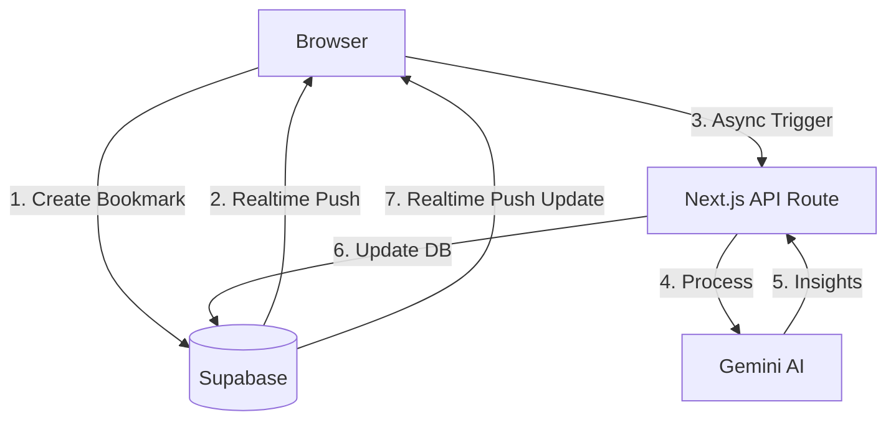
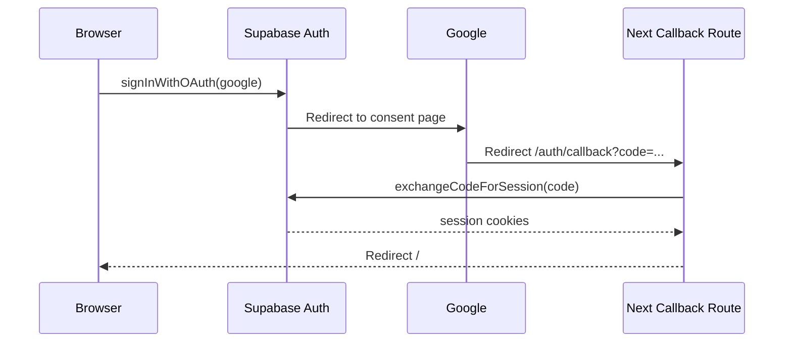
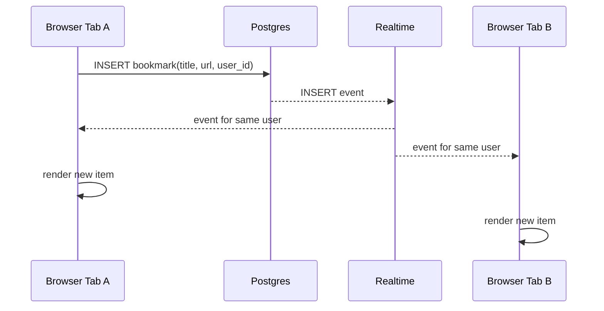
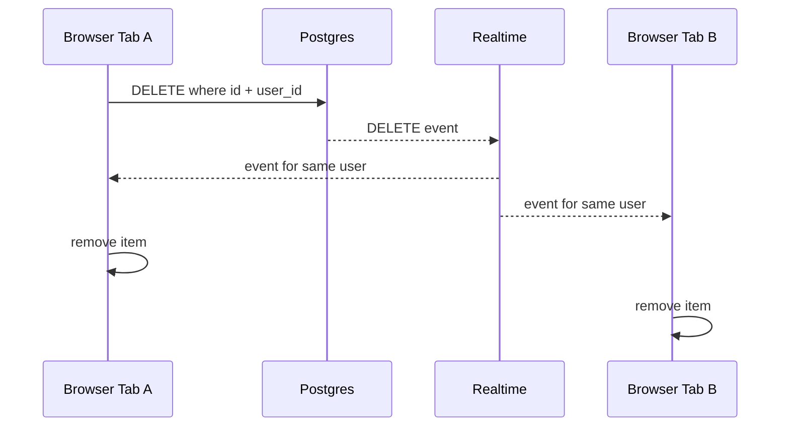

# Smart Bookmark App Deep Dive

This file is for interview preparation and technical explanation.

## 1) First Actions After Reading the Assignment

If asked: "What was the first thing you did?"

Use this answer:

1. I converted each requirement into an implementation checklist.
2. I mapped each checklist item to stack components:
   - Google login -> Supabase OAuth
   - Private data -> Postgres RLS policies
   - Live updates -> Supabase Realtime
   - Deployable app -> Next.js + Vercel env setup
3. I designed data/security first, then UI and realtime.
4. I added docs for setup, testing, and troubleshooting.

## 2) Tech Stack Breakdown

## Next.js (App Router)
- React framework with file-based routing via `src/app`.
- Server Components used for initial data fetch.
- Client Components for interactivity, real-time sync, and triggering AI flows.

## Supabase
- Auth: Google OAuth.
- Postgres: Persistent storage with RLS.
- Realtime: Postgres change listeners for sub-second UI updates.

## Gemini AI (Google)
- Model: `gemini-1.5-flash`.
- Role: Real-time metadata analysis, summarization, and categorization.

## 3) Architecture

## 4) Flowcharts

## Login Flow

## Add Bookmark Flow

## Delete Bookmark Flow

## 5) Data Model

Table: `public.bookmarks`

- `id uuid primary key default gen_random_uuid()`
- `user_id uuid references auth.users(id)`
- `title text not null`
- `url text not null`
- `created_at timestamptz default now()`

## 6) Security Model

RLS policies in `supabase/schema.sql`:

- `SELECT` only own rows (`auth.uid() = user_id`)
- `INSERT` only with own `user_id`
- `DELETE` only own rows

Why this is strong:

- Security is in DB, not just UI.
- Even manual requests cannot bypass RLS.

## 7) Realtime Implementation Notes

- Subscription listens to `postgres_changes` on table `bookmarks`.
- Filtered with `user_id=eq.<currentUserId>`.
- Handles:
  - `INSERT`: prepend new bookmark with dedupe by `id`.
  - `DELETE`: remove bookmark by `id`.

## 8) Requirement-by-Requirement Proof

1. Google auth only:
- `src/components/auth-buttons.tsx`
- no email/password forms implemented

2. Add bookmark:
- `src/components/bookmarks-client.tsx` (`insert`)

3. Private bookmarks:
- `supabase/schema.sql` RLS policies
- `src/app/page.tsx` user-scoped query

4. Realtime across tabs:
- `src/components/bookmarks-client.tsx` realtime channel

5. Delete own bookmarks:
- `src/components/bookmarks-client.tsx` (`delete ... eq("user_id", userId)`)
- RLS also enforces ownership

6. Deployable on Vercel:
- scripts/config/env included, deploy steps in `README.md`

## 9) Common Interview Questions and Strong Answers

Q: Why App Router instead of Pages Router?  
A: Assignment required it, and App Router gives a clean server/client split for auth-sensitive fetches.

Q: How did you avoid data leaks between users?  
A: I used RLS in Postgres. Even if frontend logic fails, DB policies still block unauthorized reads/writes.

Q: Why Gemini 1.5 Flash?
A: It offers extremely low latency and a high rate limit, which is perfect for real-time background processing like bookmark enrichment.

Q: How did you handle AI failures?
A: I implemented a headless trigger. If the AI service is down, the user still gets their bookmark instantly; the enrichment simply fails silently in the background without breaking the core app functionality.

Q: What would you improve next?
A: Add automated tests, full-text search across AI summaries, and a "Chat with your Bookmarks" feature using Gemini.

## 10) Troubleshooting

- OAuth redirect mismatch:
  - Ensure callback URL exists in both Supabase and Google Cloud.
- Realtime not firing:
  - Confirm table added to publication and client subscription filter is correct.
- Empty data unexpectedly:
  - Verify user session exists and RLS policies are applied correctly.
